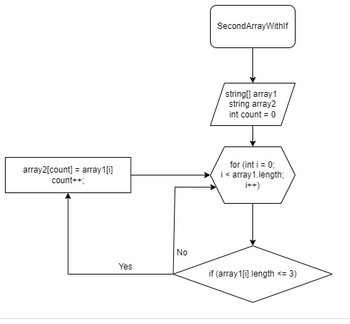

# final-verification-work
# Итоговая проверочная работа.

## 1. Создать репозиторий на GitHub
## 2. Нарисовать блок-схему алгоритма 
## 3. Снабдить репозиторий оформленным текстовым описанием решения
## 4. Написать программу, решающую поставленную задачу
## 5. Использовать контроль версий в работе над этим небольшим проектом

# Задача

*Написать программу, которая из имеющегося массива строк формирует новый массив из строк, длина которых меньше, либо равна 3 символам. Первоначальный массив можно ввести с клавиатуры, либо задать на старте выполнения алгоритма. При решении не рекомендуется пользоваться коллекциями, лучше обойтись исключительно массивами.*

# Описание алгоритма решения:
*1начала объявляется массив двух: изначальный и второй такой же выбор.* 

*2 Метод, в каком цикле соразмерный массив массива, внутри цикла проверка условий ( <=3 ), если да первый элемент массива замещается в счетчике элементов второго массива.*

*3 Добавим переменную count чтобы поочередно забросить из первого массива во второй и чтобы потом не было пробелов.*

*4 После присвоения количество перемен увеличивается на 1 и возвращается к циклу, в течение которого увеличивается на 1. И так подвержен до конца.

# Схема: 

